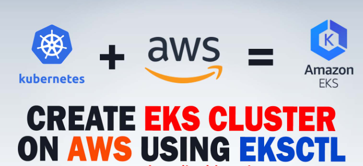
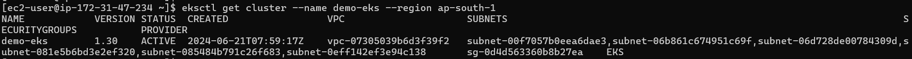

## EKS Cluster Setup Guide
### :camera: Screenshots
 
 
  

Amazon Elastic Kubernetes Service (EKS) is a fully managed container orchestration service provided by AWS. It simplifies the deployment and management of containerized applications by taking care of the Kubernetes control plane while you manage the worker nodes. This guide will walk you through setting up an EKS cluster, deploying a sample application, and setting up monitoring with Prometheus and Grafana.

Features
--------

-   **Managed Kubernetes Service**: Focus on deploying and managing containerized applications without managing the Kubernetes control plane.
-   **Scalability**: Easily scale applications and resources based on demand.
-   **Security**: Leverage AWS's robust security features for secure deployments.

Pre-requisites
--------------

1.  **AWS CLI**: Command line tools for working with AWS services, including Amazon EKS.
2.  **eksctl**: A command line tool for working with EKS clusters that automates many tasks.
3.  **kubectl**: A command line tool for working with Kubernetes clusters.
4.  **AWS Access Keys**: Ensure AWS credentials are configured in your environment.

### Setting Up AWS CLI

1.  Install the AWS CLI.
2.  Configure the AWS CLI with your credentials:
    
    `aws configure`
    
    You will be prompted for:
    -   Access key
    -   Secret access key
    -   AWS Region
    -   Output format

Creating an EKS Cluster
-----------------------

1.  Install `eksctl` following the instructions from the eksctl documentation.
2.  Create an EKS cluster using the following command:

    `eksctl create cluster --name demo-eks --region us-east-2 --nodegroup-name my-nodes --node-type t3.small --managed --nodes 2`

    This command creates an EKS cluster, which might take 15 to 20 minutes. `eksctl` uses CloudFormation under the hood, creating one stack for the EKS master control plane and another stack for the worker nodes.

### Verifying the EKS Cluster

1.  Verify the cluster creation:

    `eksctl get cluster --name demo-eks --region us-east-2`

       
 
         
             

### Connecting to the EKS Cluster

1.  Use `kubectl` to interact with the cluster:

    `kubectl get nodes
    kubectl get ns`

Deploying Nginx on the Kubernetes Cluster
-----------------------------------------

1.  Create an Nginx deployment:

    `kubectl create deployment nginx --image=nginx`

2.  View the deployments:

    `kubectl get deployments`

Deleting the EKS Cluster
------------------------

1.  Delete the EKS cluster:

    `eksctl delete cluster --name demo-eks --region us-east-2`
